# 🌫️ AQI Prediction App

<div align="center">

<!-- Animated Header -->


### 🌬️ **Machine Learning-Powered Air Quality Prediction for Indian Cities**

*Advanced XGBoost model achieving **93.3% accuracy** in real-time AQI forecasting*

---

### 🚀 **[✨ Experience Live Demo ✨](https://aqi-prediction-app-fzgwkj6ncfem6xwwdd8ta4.streamlit.app/)**


</div>

---

## 🎯 **What This App Does**

<div align="center">

</div>

A **cutting-edge Streamlit web application** that harnesses the power of machine learning to predict **Air Quality Index (AQI)** using environmental pollutants and meteorological data. Built with **XGBoost** and **Random Forest** algorithms, this app delivers **high-accuracy predictions** with smooth, real-time performance for multiple Indian cities.

---

## ⭐ **Key Features**

<table>
<tr>
<td width="50%">

### 🎯 **Smart Predictions**
- 📥 **Real-time Input**: Enter pollution levels, get instant AQI
- 🌆 **Multi-city Support**: Covers major Indian cities
- 🎯 **Category Classification**: Good, Satisfactory, Moderate, etc.
- ⚡ **Lightning Fast**: Optimized models for quick responses
- 🧠 **ML-Powered**: Hyperparameter-tuned algorithms

</td>
<td width="50%">

### 🎨 **Rich Visualizations**
- 📈 **Interactive Charts**: AQI distribution visualizations
- 📊 **Model Performance**: Comparative analysis displays
- 🎨 **Color-coded Results**: Visual AQI category indicators
- 💾 **Persistent Models**: Pre-trained and saved for deployment
- 🔄 **Real-time Updates**: Dynamic prediction updates

</td>
</tr>
</table>

---

## 🏆 **Model Performance Championship**

<div align="center">


### 🥇 **Performance Leaderboard**

| 🏅 Rank | Model | MAE | RMSE | R² Score | Performance Level |
|:--------:|:------|:---:|:----:|:--------:|:----------------:|
| 🥇 | **XGBoost (Tuned)** | `18.14` | `32.62` | **`0.933`** | 🔥 **CHAMPION** |
| 🥈 | **XGBoost** | `19.63` | `34.48` | `0.925` | ⚡ **EXCELLENT** |
| 🥉 | **Random Forest** | `19.52` | `34.95` | `0.923` | 💪 **VERY GOOD** |
| 4️⃣ | **SVR** | `23.60` | `38.39` | `0.907` | 👍 **GOOD** |
| 5️⃣ | **Linear Regression** | `55.11` | `275.79` | `-3.822` | ❌ **POOR** |

### ✅ **Winner: XGBoost (Tuned)** - *Deployed as Final Model*


</div>

---

## 🛠️ **Advanced Tech Architecture**

<div align="center">


```
┌─────────────────────┐    ┌─────────────────────┐    ┌─────────────────────┐
│    🎨 FRONTEND      │    │   🧠 ML BACKEND     │    │   ☁️ DEPLOYMENT     │
│                     │    │                     │    │                     │
│  • Streamlit UI    │◄──►│  • XGBoost Model    │◄──►│  • Streamlit Cloud  │
│  • Interactive     │    │  • Random Forest    │    │  • Auto Scaling     │
│  • Visualizations  │    │  • Scikit-learn     │    │  • 24/7 Uptime      │
│  • Real-time       │    │  • Joblib Saving    │    │  • Global CDN       │
└─────────────────────┘    └─────────────────────┘    └─────────────────────┘
            │                          │                          │
            └──────────────────────────┼──────────────────────────┘
                                       │
                    ┌─────────────────────┐
                    │   📊 DATA LAYER     │
                    │                     │
                    │  • Pandas          │
                    │  • NumPy           │
                    │  • Seaborn         │
                    │  • Matplotlib      │
                    └─────────────────────┘
```

</div>

### 🔧 **Technology Stack**

| Category | Technologies | Purpose |
|----------|-------------|---------|
| 🎨 **Frontend** | Streamlit | Interactive web interface |
| 🧠 **ML Engine** | XGBoost, Scikit-learn | Prediction algorithms |
| 📊 **Data Processing** | Pandas, NumPy | Data manipulation & analysis |
| 📈 **Visualization** | Seaborn, Matplotlib | Charts and graphs |
| 💾 **Model Storage** | Joblib | Model serialization |
| ☁️ **Deployment** | Streamlit Cloud | Hosting and scaling |

---

## 🌍 **AQI Categories & Health Impact**

<div align="center">


| AQI Range | Category | Color | Health Advisory | Recommendations |
|:---------:|:---------|:-----:|:----------------|:----------------|
| **0-50** | 🟢 **Good** | Green | Air quality is satisfactory | Enjoy outdoor activities |
| **51-100** | 🟡 **Satisfactory** | Yellow | Minor breathing issues for sensitive people | Normal activities for most people |
| **101-200** | 🟠 **Moderate** | Orange | Breathing discomfort to sensitive people | Sensitive groups limit outdoor time |
| **201-300** | 🔴 **Poor** | Red | Breathing discomfort to most people | Avoid prolonged outdoor activities |
| **301-400** | 🟣 **Very Poor** | Purple | Respiratory illness to most people | Avoid outdoor activities |
| **401-500** | 🟤 **Severe** | Maroon | Affects healthy people and seriously impacts those with existing diseases | Stay indoors |

</div>

---


### 🛠️ **Installation & Setup**

```bash
# 🔄 Step 1: Clone the Repository
git clone https://github.com/himanimahajan27/aqi-prediction-app.git

# 📁 Step 2: Navigate to Project Directory
cd aqi-prediction-app

# 🐍 Step 3: Create Virtual Environment (Recommended)
python -m venv venv
source venv/bin/activate  # On Windows: venv\Scripts\activate

# 📦 Step 4: Install Dependencies
pip install -r requirements.txt

# 🚀 Step 5: Launch the Application
streamlit run app.py
```


---

## 📊 **Model Training Pipeline**

```mermaid
graph TD
    A[🏭 Raw Environmental Data] --> B[🧹 Data Preprocessing]
    B --> C[🔍 Feature Engineering]
    C --> D[📈 Exploratory Analysis]
    D --> E[🤖 Model Training]
    E --> F[⚙️ Hyperparameter Tuning]
    F --> G[✅ Model Validation]
    G --> H[💾 Model Serialization]
    H --> I[🚀 Streamlit Deployment]
    I --> J[📊 Performance Monitoring]
    
    style E fill:#4CAF50,stroke:#333,stroke-width:3px,color:#fff
    style F fill:#FF9800,stroke:#333,stroke-width:3px,color:#fff
    style I fill:#2196F3,stroke:#333,stroke-width:3px,color:#fff
```

<div align="center">

</div>



---


---

## 🔮 **Future Enhancements**

<div align="center">

</div>

### 🚀 **Roadmap**

| Priority | Feature | Description | Timeline |
|:--------:|:--------|:------------|:---------|
| 🔥 **High** | 🔔 **Alert System** | SMS/Email notifications for unhealthy AQI | Q1 2024 |
| 🔥 **High** | 📱 **Mobile App** | Native Android/iOS application | Q2 2024 |
| ⚡ **Medium** | 🌍 **More Cities** | Expand to 100+ Indian cities | Q1 2024 |
| ⚡ **Medium** | 📈 **Historical Data** | Past AQI trends and analysis | Q2 2024 |
| 💡 **Low** | 🤖 **AI Chatbot** | Interactive AQI query assistant | Q3 2024 |
| 💡 **Low** | 🌐 **API Service** | RESTful API for developers | Q3 2024 |

---


### 🛠️ **How to Contribute**

1. 🍴 **Fork** the repository
2. 🌟 **Create** your feature branch (`git checkout -b feature/AmazingFeature`)
3. 💾 **Commit** your changes (`git commit -m 'Add some AmazingFeature'`)
4. 📤 **Push** to the branch (`git push origin feature/AmazingFeature`)
5. 🔄 **Open** a Pull Request

### 🎯 **Contribution Areas**

- 📊 **Data Science**: Model improvements, new algorithms
- 🎨 **UI/UX**: Interface enhancements, visualizations
- 🔧 **DevOps**: CI/CD, monitoring, optimization
- 🌍 **Domain Expertise**: Environmental science insights
- 📝 **Documentation**: Guides, tutorials, examples

---

---

## 👨‍💻 **About the Developer**

<div align="center">


### **Made with ❤️ by Himani Mahajan**

[](https://github.com/himanimahajan27)
[](mailto:himanimahajan2709@gmail.com)
[](https://www.linkedin.com/in/himani-mahajan-9553732ab/)

</div>

---

<div align="center">


### 💫 **"Predicting air quality today for a healthier tomorrow"**


</div>
